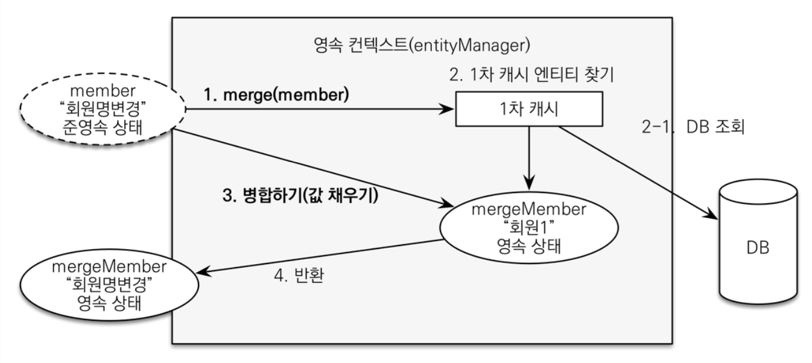

# Spring Boot + JPA 예제 1
> 본 학습 테스트는 [김영한님의 스프링 부트 + JPA 활용 1편](https://www.inflearn.com/course/%EC%8A%A4%ED%94%84%EB%A7%81%EB%B6%80%ED%8A%B8-JPA-%ED%99%9C%EC%9A%A9-1)을 바탕으로 진행된 자료입니다.

<br>

# 목차

<br>

- [Spring Boot + JPA 예제 1](#spring-boot--jpa-예제-1)
- [목차](#목차)
- [꼭 잡고가야할 개념](#꼭-잡고가야할-개념)
- [도메인 모델 및 테이블 설계](#도메인-모델-및-테이블-설계)
  - [요구사항 정리](#요구사항-정리)
  - [도메인 모델과 테이블 설계](#도메인-모델과-테이블-설계)
  - [엔티티 설계시 주의할 점 - 중요](#엔티티-설계시-주의할-점---중요)
    - [엔티티는 가급적 Setter를 사용하지 말자.](#엔티티는-가급적-setter를-사용하지-말자)
    - [모든 연관관계는 지연로딩으로 설정](#모든-연관관계는-지연로딩으로-설정)
    - [컬렉션은 필드에서 초기화하자 (Best Practice라고 함)](#컬렉션은-필드에서-초기화하자-best-practice라고-함)
    - [테이블, 컬럼명 생성 전략](#테이블-컬럼명-생성-전략)
- [도메인 별 배운 점](#도메인-별-배운-점)
  - [회원 도메인](#회원-도메인)
  - [주문 도메인](#주문-도메인)
- [변경 감지와 병합 (merge)](#변경-감지와-병합-merge)
  - [준영속 엔티티](#준영속-엔티티)
  - [준영속 엔티티 수정 1 - 변경 감지 기능 사용](#준영속-엔티티-수정-1---변경-감지-기능-사용)
  - [준영속 엔티티 수정 2 - 병합(merge) 사용](#준영속-엔티티-수정-2---병합merge-사용)
  - [결론 - 엔티티를 변경할 때는 항상 더티 체킹을 사용하라](#결론---엔티티를-변경할-때는-항상-더티-체킹을-사용하라)

<br>

# 꼭 잡고가야할 개념
* 동적 쿼리
* 준영속

<br>

# 도메인 모델 및 테이블 설계

<br>

## 요구사항 정리
> 간단한 쇼핑몰을 만드는 프로젝트
* 회원 기능
  * 회원 등록
  * 회원 목록
* 상품 기능
  * 상품 등록
  * 상품 수정
  * 상품 목록
* 주문 기능
  * 상품 주문
  * 주문 내역 조회
  * 주문 취소
* 기타 요구사항
  * 상품은 재고 관리가 필요하다.
  * 상품의 종류는 도서, 음반, 영화가 있다.
  * 상품을 카테고리로 구분할 수 있다.
  * 상품 주문시 배송 정보를 입력할 수 있다.

<br>

## 도메인 모델과 테이블 설계
<p align="center"><br>출처: 김영한님의 JPA 활용 강의 1</p>

연관관계에 대한 내용은 어렵지 않으므로.. [domain](./src/main/java/com/binghe/springbootjpaexample1/shoppin_mall/domain)쪽 클래스 파일들을 살펴보면 된다.

<br>

## 엔티티 설계시 주의할 점 - 중요

<br>

### 엔티티는 가급적 Setter를 사용하지 말자.
* 변경 포인트가 너무 많아 유지보수가 힘듬.

<br>

### 모든 연관관계는 지연로딩으로 설정
* 즉시로딩은 예측이 어렵고, 어떤 SQL 쿼리 실행될지 추적하기 어렵다. 특히 N + 1 문제 발생할 확률이 높다.
* 실무에서는 가급적 모두 `LAZY`로 설정하자.
* 연관된 엔티티를 함께 DB로부터 조회해야한다면, `fetch join`이나 엔티티 그래프 탐색으로 지연 로딩을 사용하자.
* 헷갈리게... `@ManyToOne`과 `@OneToOne`은 디폴트가 `EAGER`다.. 나머지는 `LAZY`

<br>

### 컬렉션은 필드에서 초기화하자 (Best Practice라고 함)
* `null`문제에서 안전
* 하이버네이트는 아래와 같이 엔티티를 영속화할 때, 자체적인 컬렉션으로 한번 더 감싼다고 한다. (컬렉션을 추적하기 위함)
  * 아래 예시의 `getOrders()`처럼 임의의 메서드에서 컬렉션을 잘못 생각하면 하이버네이트 내부 매커니즘에 문제가 발생할 수 있다고 한다.
  * 따라서 필드레벨에서 생성하는 것이 좋다고 함

```java
Member member = new Member();
System.out.println(member.getOrders().getClass());
em.persist(team);
System.out.println(member.getOrders().getClass());

// 누군가가 아래와 같이 영속화된 컬렉션을 setter하면 영속성 컨텍스트를 전혀 활용하지 못하게 된다.
member.setOrders(...); // 문제의 코드

//출력 결과
class java.util.ArrayList
class org.hibernate.collection.internal.PersistentBag
```
> 가능한 엔티티안의 컬렉션은 바꾸지 말고, 처음 생성한 그대로 사용하는 것이 좋다. 아님 하이버네이트의 기능을 사용하지 못할 수도 있다!

<br>

### 테이블, 컬럼명 생성 전략
자바 엔티티에서의 필드명과 DB에서의 필드명을 다르게 설정해줄 수 있다.

그리고 스프링 부트는 하이버네이트 기본 매핑 전략을 변경해서 실제 테이블 필드명이 조금 다르다

* 하이버네이트 기존 구현: 엔티티의 필드명을 그대로 테이블의 컬럼명으로 사용한다.
  * `SpringPhysicalNamingStrategy`
* 스프링 부트 기본 설정
  * 카멜 케이스: 언더스코어 (memberPoint -> member_point)
  * . (점) -> 언더스코어(_)
  * 대문자 -> 소문자
* 논리명과 물리명으로 나뉜다.
  * 논리명: 명시적으로 컬럼, 테이블명을 직접 적지 않으면 ImplicitNamingStrategy사용
    * 명시적으로 엔티티 컬럼에 설정하는 것을 의미하는 듯.
  * 물리명: 모든 논리명에 적용된다. (실제 테이블에 username -> usernm 등으로 새로운 룰을 만들 수 있다.)
    * 한번 설정하면 모든 엔티티 컬럼에 적용되는 것을 의미하는 듯.

<br>

# 도메인 별 배운 점

<br>

## 회원 도메인
* 중복확인에서 여러 스레드가 동시에 접근하여 동시성 문제가 발생할 수 있다. 이를 방지하는 방안중 하나는 DB 중복이 안되는 컬럼에 `unique` 설정을 해준다.
* JPA의 영속성 컨텍스트는 하나의 트랜잭션 안에서 동작한다.
  * 그리고 하나의 트랜잭션 안에선 동일성을 보장하기 때문에 `isSameAs`테스트가 성공한다.

<br>

## 주문 도메인
* 복잡하게 엮어있는 엔티티도 해당 엔티티를 영속화시키기위한 정보들을 하나하나 만들어가면 된다.
  * ex. 주문 1 --- N 주문상품 N --- 1 상품 (주문 N : N 상품)
    * 주문을 생성한다고 가정한다면 -> 상품을 먼저 생성하여 영속화시키고, 주문상품을 영속화한다. (이때 주문에 대한 내용은 null로 둔다.)
    * 마지막으로 주문을 영속화한다.
* CASCADE는 어디까지 설정해야하는가?
  * 만약 다른 엔티티에서 해당 엔티티를 참조하지 않는다면 `ALL`로 해도 된다.
    * 즉, 생명주기가 하나의 엔티티로만 처리된다면 `ALL`로 두고 그게 아니라면 상황에 따라 범위를 좁혀가게 설정한다.
  * 만약 다른 엔티티에서도 해당 엔티티를 참조한다면 CASCADE를 사용하지 않거나, 범위를 작게 하는 것이 좋다.
* 도메인 모델 패턴
  * 엔티티가 비즈니스 로직을 가지고 객체 지향의 특성을 적극 활용하여 비즈니스 로직을 구성하는 것을 [도메인 모델 패턴](https://martinfowler.com/eaaCatalog/domainModel.html)이라 부른다.
  * 반대로 서비스 계층에 대부분의 비즈니스 로직을 처리하는 것을 [트랜잭션 스크립트 패턴](https://martinfowler.com/eaaCatalog/transactionScript.html)이라 부른다.
* 동적 쿼리 처리방법
  * 동적 쿼리를 사용하는 방법은 여러가지다. 다만 궁극적인 해결방안은 QueryDSL이다. [코드](./src/main/java/com/binghe/springbootjpaexample1/shoppin_mall/repository/OrderRepository.java)참고
  * 방법 1 - JPQL (String) -> Bad Practice
  * 방법 2 - Criteria -> Bad Practice
  * 방법 3 - QueryDsl - Best Practice

<br>

# 변경 감지와 병합 (merge)
> 정말 중요한 내용이므로 꼭 완벽히 이해하고 넘어가야한다.

<br>

## 준영속 엔티티

🤔 준영속 엔티티

* 영속성 컨텍스트가 더 이상 관리하지 않는 엔티티를 의미한다.
* 보통 영속 상태의 엔티티를 영속성 컨텍스트에서 분리(detach)한 상태를 의미힌다.
  * DB에 한번 저장하여 식별자(id)가 존재한다면 준영속 상태라고 볼 수 있다. (서로 다른 트랜잭션이라도 식별자만 제대로 가지고있는 엔티티라면 준영속이라고 볼 수 있다.)

예시를 통해 보자면

```java
@GetMapping("/items/{itemId}/edit")
public String updateItemForm(@PathVariable("itemId")Long itemId, Model model) {
    Book item = (Book) itemService.findById(itemId);

     Book book = new Book(item.getAuthor(), item.getIsbn());
     book.setName(item.getName());
     book.setPrice(item.getPrice());
     book.setStockQuantity(item.getStockQuantity());
     
     // book.setXXX 해도 이 요청에서 book의 DB상태는 변경되지 않는다. (더티체킹이 발생하지 않음)

     model.addAttribute("form", book);
     return "items/updateItemForm";
 }
```

<br>

## 준영속 엔티티 수정 1 - 변경 감지 기능 사용
```java
@Transactional
void update(Item itemParam) { // 파라미터로 넘어온 준영속 상태의 엔티티
    Item findItem = em.find(Item.class, itemParam.getId()); // 같은 엔티티를 조회. (영속)
    findItem.setPrice(itemParam.getPrice()); // 데이터 수정
    // 이때 flush가 발생하여 더티체킹이 발생.
}
```

<br>

## 준영속 엔티티 수정 2 - 병합(merge) 사용
```java
// merge 코드
@Transactional
void update(Item itemPrice) { // 파라미터로 넘어온 준영속 상태의 엔티티
    Item mergeItem = em.merge(item); // 병합!
}

// merge과 동일한 역할을 하는 코드
Item update(Long itemId, Book param) { // 원래는 비영속인 Item만 들어왔지만, 이번엔 식별자와 식별자가 없는 Book이 매개변수로 넘어온다.
    Item findItem = itemRepository.findById(itemId);
    findItem.setPrice(param.getPrice());
    findItem.setName(param.getName());
    findItem.setStockQuantity(param.getStockQuantity());
    return findItem; // 기존의 파라미터로 넘어온 Book을 영속화하는 것이 아닌, 새로운 엔티티를 만들어 영속화한!!
}
```

<p align="center"><br>출처: 김영한님의 JPA 책</p>

* 병합은 준영속 상태의 엔티티를 영속 상태로 변경할 때 사용하는 기능.
* 병합의 경우, 준영속 상태의 엔티티의 값을 모두 다 바꿔치기한다. -> 즉, 모든 상태의 값이 변경되었으므로 모든 상태에 대해서 더티체킹이 발생한다.
* 병합의 동작 방식
  1. `merge(detachedItem)`를 실행한다.
  2. 파라미터로 넘어온 준영속 엔티티의 식별자 값으로 1차 캐시에서 엔티티를 조회한다.
    * 만약 1차 캐시에 없다면 DB에서 엔티티를 조회하고, 1차 캐시에 저장한다.
  3. 조회한 영속 엔티티(`mergeItem`)에 `detachedItem`엔티티의 상태 값을 값을 채워넣는다.
    * `detachedItem`엔티티의 모든 값을 `mergeItem`에 밀어넣는다. 이때, `mergeItem`와 `detachedItem`간의 상태값은 모두 덮어씌워진다.
    * 즉, 병합은 모든 필드를 교체한다. 이를 통해 더티체킹이 가능하게하는 것.
  4. 영속 상태의 `mergeItem`를 반환한다.

> 또한, 파라미터로 넘어온 준영속 엔티티는 영속화 되지 않는다. 그저 새로운 값으로 모두 매핑하여 반환만 한다.

<br>

🤔 병합 주의할 점

* 변경 감지 기능을 사용하면 원하는 속성만 선택해서 변경할 수 있지만, 병합을 사용하면 모든 속성이 변경된다.
  * 즉, 병합시 값이 없으면 `null`로 업데이트되는 위험이 있다. (병합은 모든 필드를 교체하기 때문!)
* **다시 한번 말하지만... 병합은 넘어온 파라미터의 엔티티를 식별자를 기준으로 상태를 모두 덮어씌운다.**

> 병합을 사용하면 안되는 이유 - 예시
```java
@DisplayName("준영속 상태를 업데이트하는 방법 - 병합 (merge)")
public void updateTest_merge() {
    // given
    Book book = new Book("작가", "isbn");
    book.setPrice(10_000);
    book.setName("테스트용 책");
    book.setStockQuantity(10);

    em.persist(book);
    em.flush();
    em.clear();

    // when (식별자를 가진 준영속 엔티티를 병합하여 모든 내용을 DB에 엎어씌운다)
    Book detachedBook = new Book("작가", "isbn");
    book.setId(book.getId());
    book.setPrice(1_000); // 덮어씌워진다.
    book.setName(null);   // null이므로 DB에도 null로 저장된다. (가장 큰 문제! 상태 변경을 원하지 않지만, merge는 모든 상태를 업데이트한다.)
    book.setStockQuantity(10); // 덮어씌워진다.

    Book mergedBook = em.merge(detachedBook); // detachedBook이 아닌 mergedBook이 영속화된다.
    em.flush();
    em.clear();

    // then
    Book updatedBook = em.find(Book.class, mergedBook.getId());
    assertThat(updatedBook.getName()).isNull(); // null이기를 원하지않지만, 병합은 덮어씌우는 것이기때문에 null이 되어있다.
    assertThat(updatedBook.getPrice()).isEqualTo(1_000);
    assertThat(updatedBook.getStockQuantity()).isEqualTo(book.getStockQuantity());
}
```
* 단점
  * `price`가 `null`로 변경된 것을 볼 수 있다. (원하지 않는 결과)
  * 특정 값만 변경하고 싶을 때, 어디서 해당 값을 변경하는지 추적하지 쉽지 않다.

> 그냥 병합은 사용하지 말자 :) 

<br>

## 결론 - 엔티티를 변경할 때는 항상 더티 체킹을 사용하라
* 그냥 가장 좋은 방법은 엔티티를 변경할 때 항상 더티 체킹을 사용하는 것이다.
* 컨트롤러에서 어설프게 엔티티를 생성하지 말자. (나도 모르게 준영속 엔티티를 생성할 가능성이 크다)
* 트랜잭션이 있는 서비스 계층에게 식별자(`id`)와 변경할 데이터만을 명확하게 전달하라 (파라미터나 dto로)
* 트랜잭션이 있는 서비스 계층에서 영속 상태의 엔티티를 조회하고, 엔티티의 데이터를 직접 변경하라. (더티체킹)


