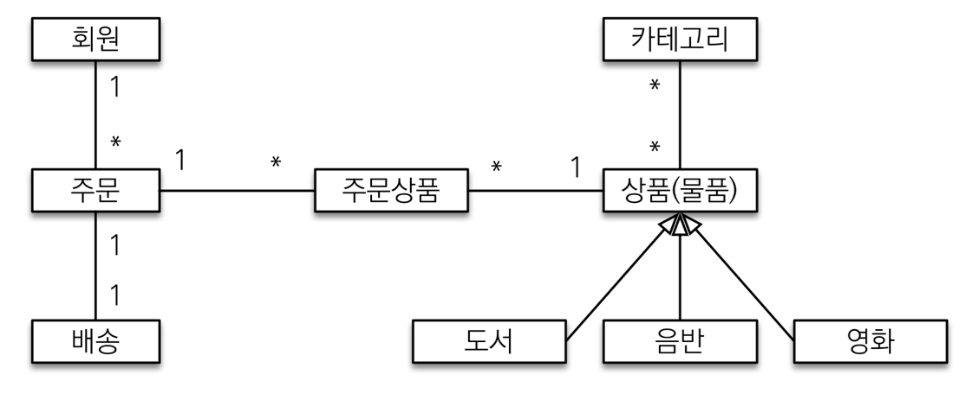

# Spring Boot + JPA 예제 1
> 본 학습 테스트는 [김영한님의 스프링 부트 + JPA 활용 1편](https://www.inflearn.com/course/%EC%8A%A4%ED%94%84%EB%A7%81%EB%B6%80%ED%8A%B8-JPA-%ED%99%9C%EC%9A%A9-1)을 바탕으로 진행된 자료입니다.

<br>

# 목차

<br>

<br>

# 도메인 모델 및 테이블 설계

<br>

## 요구사항 정리
> 간단한 쇼핑몰을 만드는 프로젝트
* 회원 기능
  * 회원 등록
  * 회원 목록
* 상품 기능
  * 상품 등록
  * 상품 수정
  * 상품 목록
* 주문 기능
  * 상품 주문
  * 주문 내역 조회
  * 주문 취소
* 기타 요구사항
  * 상품은 재고 관리가 필요하다.
  * 상품의 종류는 도서, 음반, 영화가 있다.
  * 상품을 카테고리로 구분할 수 있다.
  * 상품 주문시 배송 정보를 입력할 수 있다.

<br>

## 도메인 모델과 테이블 설계
<p align="center"><br>출처: 김영한님의 JPA 활용 강의 1</p>

연관관계에 대한 내용은 어렵지 않으므로.. [domain](./src/main/java/com/binghe/springbootjpaexample1/shoppin_mall/domain)쪽 클래스 파일들을 살펴보면 된다.

<br>

## 엔티티 설계시 주의할 점 - 중요

<br>

### 엔티티는 가급적 Setter를 사용하지 말자.
* 변경 포인트가 너무 많아 유지보수가 힘듬.

<br>

### 모든 연관관계는 지연로딩으로 설정
* 즉시로딩은 예측이 어렵고, 어떤 SQL 쿼리 실행될지 추적하기 어렵다. 특히 N + 1 문제 발생할 확률이 높다.
* 실무에서는 가급적 모두 `LAZY`로 설정하자.
* 연관된 엔티티를 함께 DB로부터 조회해야한다면, `fetch join`이나 엔티티 그래프 탐색으로 지연 로딩을 사용하자.
* 헷갈리게... `@ManyToOne`과 `@OneToOne`은 디폴트가 `EAGER`다.. 나머지는 `LAZY`

<br>

### 컬렉션은 필드에서 초기화하자 (Best Practice라고 함)
* `null`문제에서 안전
* 하이버네이트는 아래와 같이 엔티티를 영속화할 때, 자체적인 컬렉션으로 한번 더 감싼다고 한다. (컬렉션을 추적하기 위함)
  * 아래 예시의 `getOrders()`처럼 임의의 메서드에서 컬렉션을 잘못 생각하면 하이버네이트 내부 매커니즘에 문제가 발생할 수 있다고 한다.
  * 따라서 필드레벨에서 생성하는 것이 좋다고 함

```java
Member member = new Member();
System.out.println(member.getOrders().getClass());
em.persist(team);
System.out.println(member.getOrders().getClass());

// 누군가가 아래와 같이 영속화된 컬렉션을 setter하면 영속성 컨텍스트를 전혀 활용하지 못하게 된다.
member.setOrders(...); // 문제의 코드

//출력 결과
class java.util.ArrayList
class org.hibernate.collection.internal.PersistentBag
```
> 가능한 엔티티안의 컬렉션은 바꾸지 말고, 처음 생성한 그대로 사용하는 것이 좋다. 아님 하이버네이트의 기능을 사용하지 못할 수도 있다!

<br>

### 테이블, 컬럼명 생성 전략
자바 엔티티에서의 필드명과 DB에서의 필드명을 다르게 설정해줄 수 있다.

그리고 스프링 부트는 하이버네이트 기본 매핑 전략을 변경해서 실제 테이블 필드명이 조금 다르다

* 하이버네이트 기존 구현: 엔티티의 필드명을 그대로 테이블의 컬럼명으로 사용한다.
  * `SpringPhysicalNamingStrategy`
* 스프링 부트 기본 설정
  * 카멜 케이스: 언더스코어 (memberPoint -> member_point)
  * . (점) -> 언더스코어(_)
  * 대문자 -> 소문자
* 논리명과 물리명으로 나뉜다.
  * 논리명: 명시적으로 컬럼, 테이블명을 직접 적지 않으면 ImplicitNamingStrategy사용
    * 명시적으로 엔티티 컬럼에 설정하는 것을 의미하는 듯.
  * 물리명: 모든 논리명에 적용된다. (실제 테이블에 username -> usernm 등으로 새로운 룰을 만들 수 있다.)
    * 한번 설정하면 모든 엔티티 컬럼에 적용되는 것을 의미하는 듯.

<br>

### 

